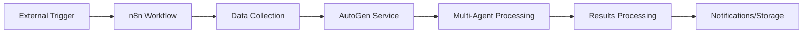
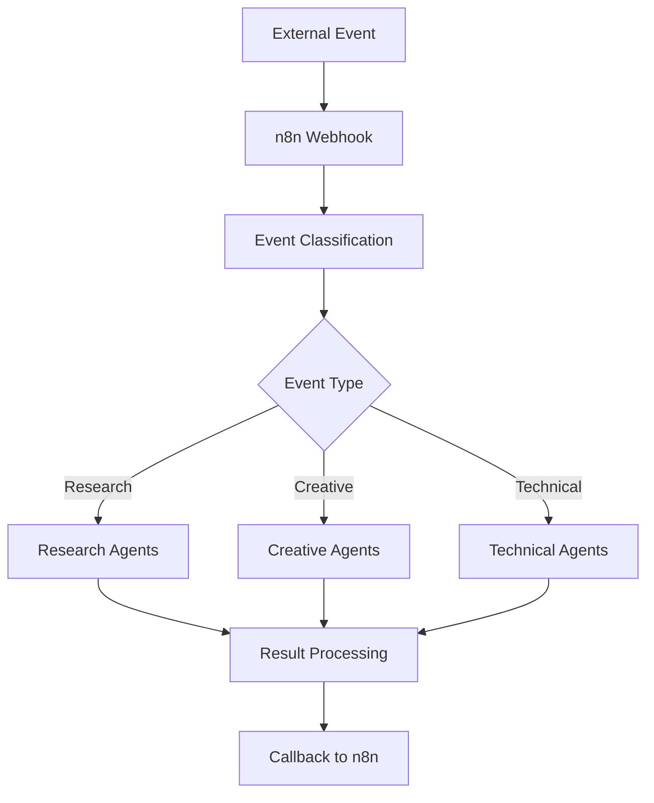
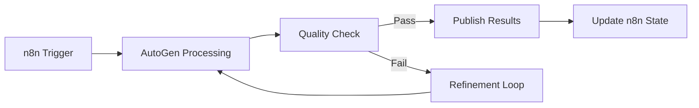

# n8n + AutoGen Integration Guide

This guide shows you how to combine n8n's powerful workflow orchestration with AutoGen's multi-agent capabilities for building sophisticated automation systems.

## 🎯 **What You Get**

### **n8n Handles**:
- 🔄 Workflow orchestration and scheduling  
- 🔌 API integrations and data sources
- 📊 Data transformation and routing
- 📧 Notifications and external service calls
- 🗄️ Database operations and file management

### **AutoGen Handles**:
- 🤖 Multi-agent conversations and reasoning
- 🧠 Complex decision-making and analysis
- ✍️ Content creation and review processes
- 🔍 Research and knowledge synthesis
- 💡 Creative problem-solving and brainstorming

## 🚀 **Quick Start**

### **Step 1: Start the Services**
```bash
# Clone and setup
cd /Users/rkbotla/apps/vibe-experiments/agentic

# Set your API keys
export OPENAI_API_KEY="your-openai-key"
export ANTHROPIC_API_KEY="your-anthropic-key"  # optional

# Start with Docker Compose
docker-compose -f docker-compose.n8n-autogen.yml up -d

# Or run locally for development
python patterns/n8n_autogen_integration.py serve
```

### **Step 2: Access n8n**
- Open http://localhost:5678
- Login: admin / n8n_demo_password
- Import workflow examples from `n8n_research_workflow.json`

### **Step 3: Test Integration**
```bash
# Test AutoGen service directly
curl -X POST http://localhost:5000/workflow/execute \
  -H "Content-Type: application/json" \
  -d '{
    "workflow_type": "research_analysis",
    "task": "Analyze renewable energy trends",
    "parameters": {"focus_areas": ["solar", "wind", "storage"]}
  }'
```

## 🏗️ **Integration Patterns**

### **Pattern 1: n8n Orchestrator + AutoGen Processor**



**Use Cases**:
- Scheduled content creation
- Automated research reports
- Code review workflows
- Customer support escalation

### **Pattern 2: Event-Driven Integration**



**Use Cases**:
- Dynamic task routing
- Conditional agent selection
- Real-time processing pipelines

### **Pattern 3: Feedback Loop Integration**



**Use Cases**:
- Iterative content improvement
- Quality-gated workflows
- Self-improving processes

## 🔧 **Available Workflows**

### **1. Research Analysis**
```json
{
  "workflow_type": "research_analysis",
  "task": "Research topic description",
  "parameters": {
    "focus_areas": ["area1", "area2"],
    "depth": "comprehensive"
  }
}
```
**Agents**: Researcher → Analyst → Synthesizer

### **2. Content Creation**
```json
{
  "workflow_type": "content_creation", 
  "task": "Content brief description",
  "parameters": {
    "target_audience": "professionals",
    "tone": "informative",
    "word_count": 800,
    "content_type": "blog_post"
  }
}
```
**Agents**: Writer → Editor → Reviewer

### **3. Code Review**
```json
{
  "workflow_type": "code_review",
  "task": "def function_to_review():\n    pass",
  "parameters": {
    "language": "python",
    "context": "API endpoint function"
  }
}
```
**Agents**: Security Reviewer → Performance Reviewer → Style Reviewer

### **4. Customer Support**
```json
{
  "workflow_type": "customer_support",
  "task": "Customer inquiry description", 
  "parameters": {
    "customer_tier": "premium",
    "previous_tickets": 3
  }
}
```
**Agents**: Classifier → Technical Support → Customer Success

### **5. Data Processing**
```json
{
  "workflow_type": "data_processing",
  "task": "Data to analyze",
  "parameters": {
    "analysis_type": "trend_analysis"
  }
}
```
**Agents**: Data Analyzer → Insights Generator

### **6. Creative Brainstorm**
```json
{
  "workflow_type": "creative_brainstorm",
  "task": "Creative challenge description",
  "parameters": {
    "constraints": ["budget", "timeline"],
    "target_outcome": "increase engagement"
  }
}
```
**Agents**: Ideator → Critic → Synthesizer

## 📊 **n8n Workflow Examples**

### **Research Pipeline Workflow**

```json
{
  "name": "AutoGen Research Pipeline",
  "nodes": [
    {
      "name": "Schedule Trigger",
      "type": "n8n-nodes-base.cron",
      "parameters": {
        "rule": {
          "interval": [{"field": "cronExpression", "expression": "0 9 * * 1"}]
        }
      }
    },
    {
      "name": "Get Research Topics", 
      "type": "n8n-nodes-base.airtable",
      "parameters": {
        "operation": "list",
        "application": "research_queue",
        "table": "topics"
      }
    },
    {
      "name": "Execute AutoGen Research",
      "type": "n8n-nodes-base.httpRequest",
      "parameters": {
        "url": "http://autogen-service:5000/workflow/execute",
        "method": "POST",
        "body": {
          "workflow_type": "research_analysis",
          "task": "={{ $json.topic }}",
          "parameters": {
            "focus_areas": "={{ $json.focus_areas }}"
          }
        }
      }
    },
    {
      "name": "Save Results",
      "type": "n8n-nodes-base.postgres", 
      "parameters": {
        "operation": "insert",
        "table": "research_results",
        "columns": "topic,results,agents,execution_time"
      }
    }
  ]
}
```

### **Content Creation Pipeline**

```json
{
  "name": "AutoGen Content Creation",
  "nodes": [
    {
      "name": "Content Request Webhook",
      "type": "n8n-nodes-base.webhook",
      "parameters": {
        "path": "content-request"
      }
    },
    {
      "name": "Execute AutoGen Content Creation",
      "type": "n8n-nodes-base.httpRequest", 
      "parameters": {
        "url": "http://autogen-service:5000/workflow/execute",
        "method": "POST",
        "body": {
          "workflow_type": "content_creation",
          "task": "={{ $json.content_brief }}",
          "parameters": {
            "target_audience": "={{ $json.audience }}",
            "tone": "={{ $json.tone }}",
            "word_count": "={{ $json.word_count }}"
          }
        }
      }
    },
    {
      "name": "Publish to CMS",
      "type": "n8n-nodes-base.wordpress",
      "parameters": {
        "operation": "create",
        "title": "={{ $json.title }}",
        "content": "={{ $json.result.final_content }}"
      }
    }
  ]
}
```

## 🔍 **Monitoring & Debugging**

### **Service Health Checks**
```bash
# Check AutoGen service
curl http://localhost:5000/health

# Check workflow status  
curl http://localhost:5000/workflow/status/workflow_id

# List active workflows
curl http://localhost:5000/workflows/active
```

### **n8n Monitoring**
- Workflow executions: http://localhost:5678/workflows
- Execution history and logs
- Error tracking and retry mechanisms

### **Database Queries**
```sql
-- Check workflow results
SELECT * FROM research_results ORDER BY created_at DESC LIMIT 10;

-- Monitor performance
SELECT 
  workflow_type,
  AVG(execution_time) as avg_time,
  COUNT(*) as total_runs
FROM workflow_logs 
GROUP BY workflow_type;
```

## 🔐 **Security & Production Setup**

### **Environment Variables**
```bash
# Required API Keys
OPENAI_API_KEY=your-openai-key
ANTHROPIC_API_KEY=your-anthropic-key

# Database Configuration  
POSTGRES_HOST=localhost
POSTGRES_DB=autogen_db
POSTGRES_USER=autogen_user
POSTGRES_PASSWORD=secure_password

# Redis Configuration
REDIS_HOST=localhost
REDIS_PORT=6379

# Service Configuration
FLASK_ENV=production
N8N_BASIC_AUTH_ACTIVE=true
N8N_BASIC_AUTH_USER=admin
N8N_BASIC_AUTH_PASSWORD=secure_password
```

### **Production Checklist**
- [ ] Use environment-specific API keys
- [ ] Enable HTTPS with SSL certificates
- [ ] Set up database backups
- [ ] Configure log rotation
- [ ] Implement rate limiting
- [ ] Set up monitoring alerts
- [ ] Use secrets management (e.g., HashiCorp Vault)

## 🎓 **Advanced Examples**

### **Custom n8n Node for AutoGen**

Create a custom node that integrates directly with AutoGen:

```typescript
// nodes/AutoGenWorkflow/AutoGenWorkflow.node.ts
export class AutoGenWorkflow implements INodeType {
  description: INodeTypeDescription = {
    displayName: 'AutoGen Workflow',
    name: 'autoGenWorkflow',
    properties: [
      {
        displayName: 'Workflow Type',
        name: 'workflowType',
        type: 'options',
        options: [
          {name: 'Research Analysis', value: 'research_analysis'},
          {name: 'Content Creation', value: 'content_creation'},
          {name: 'Code Review', value: 'code_review'}
        ]
      }
    ]
  };

  async execute(this: IExecuteFunctions): Promise<INodeExecutionData[][]> {
    // Implementation here
  }
}
```

### **Webhook Integration with Callbacks**

```javascript
// n8n webhook that handles AutoGen callbacks
{
  "name": "AutoGen Callback Handler",
  "nodes": [
    {
      "name": "AutoGen Callback",
      "type": "n8n-nodes-base.webhook",
      "parameters": {
        "path": "autogen-callback",
        "httpMethod": "POST"
      }
    },
    {
      "name": "Process Results",
      "type": "n8n-nodes-base.function", 
      "parameters": {
        "functionCode": `
          const result = $input.first().json;
          
          if (result.success) {
            // Process successful result
            return [{
              json: {
                status: 'completed',
                workflow_id: result.workflow_id,
                output: result.result,
                processing_time: result.execution_time
              }
            }];
          } else {
            // Handle error case
            return [{
              json: {
                status: 'failed',
                workflow_id: result.workflow_id,
                error: result.error
              }
            }];
          }
        `
      }
    }
  ]
}
```

### **Dynamic Agent Configuration**

```python
# Advanced AutoGen service with dynamic agent creation
class DynamicAutoGenService(AutoGenN8NService):
    def create_custom_workflow(self, config: Dict[str, Any]):
        agents = []
        
        for agent_config in config['agents']:
            agent = autogen.AssistantAgent(
                name=agent_config['name'],
                system_message=agent_config['system_message'],
                llm_config=self.llm_config
            )
            agents.append(agent)
        
        # Create dynamic group chat
        groupchat = autogen.GroupChat(
            agents=agents,
            messages=[],
            max_round=config.get('max_rounds', 6)
        )
        
        return groupchat
```

## 🔧 **Troubleshooting**

### **Common Issues**

**1. Connection Errors**
```bash
# Check service connectivity
docker-compose -f docker-compose.n8n-autogen.yml logs autogen-service
docker-compose -f docker-compose.n8n-autogen.yml logs n8n
```

**2. API Key Issues**
```bash
# Verify API keys are set
docker exec -it autogen_service env | grep API_KEY
```

**3. Memory Issues**
```bash
# Check container resources
docker stats
```

**4. Database Connection**
```bash
# Test database connection
docker exec -it postgres_db psql -U autogen_user -d autogen_db -c "SELECT version();"
```

### **Performance Optimization**

1. **Redis Caching**: Enable Redis for workflow state management
2. **Connection Pooling**: Use connection pools for database operations
3. **Async Processing**: Implement async processing for long-running workflows  
4. **Resource Limits**: Set appropriate container resource limits
5. **Load Balancing**: Use multiple AutoGen service instances for high load

## 📈 **Scaling & Production**

### **Horizontal Scaling**
```yaml
# docker-compose.yml scaling configuration
services:
  autogen-service:
    deploy:
      replicas: 3
    
  nginx:
    image: nginx:alpine
    ports:
      - "80:80"
    volumes:
      - ./nginx.conf:/etc/nginx/nginx.conf
```

### **Monitoring Setup**
- **Prometheus**: Metrics collection
- **Grafana**: Visualization dashboards  
- **ELK Stack**: Centralized logging
- **Health Checks**: Automated service monitoring

This integration gives you the power to build sophisticated automation workflows that combine n8n's orchestration capabilities with AutoGen's multi-agent intelligence!

## 🎯 **Next Steps**

1. **Start Simple**: Begin with the research analysis workflow
2. **Customize Agents**: Modify agent system messages for your domain
3. **Add Integrations**: Connect to your existing tools and databases
4. **Scale Up**: Add more workflow types and agent combinations
5. **Monitor & Optimize**: Use the built-in monitoring to improve performance

Happy automating! 🚀